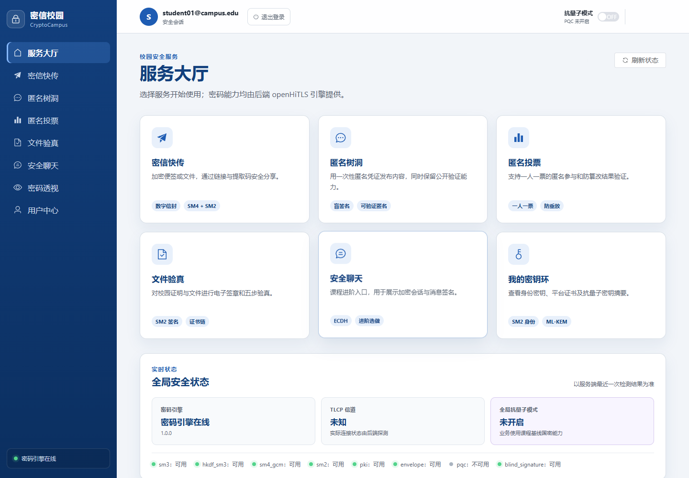
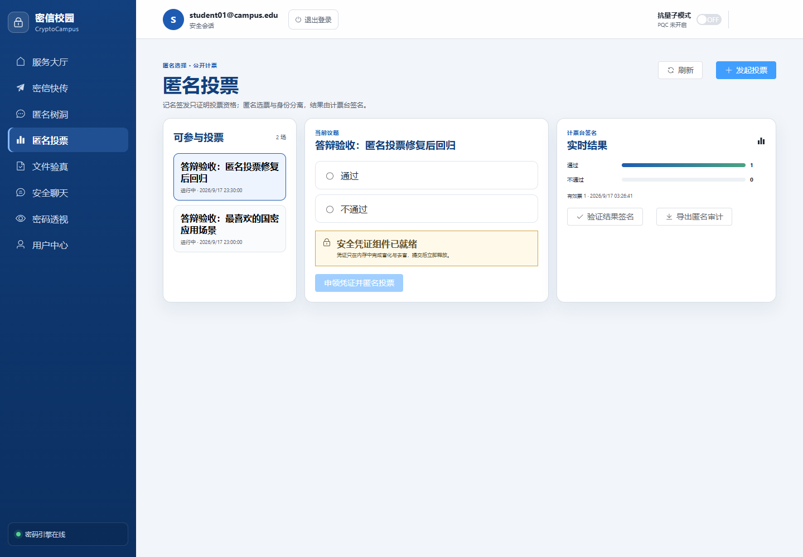
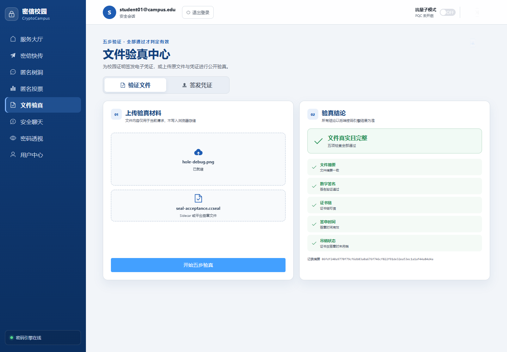

  

<h1 align="center">CryptoCampus · 密信校园</h1>

  让密码技术走进校园应用 
  身份与证书 · 加密分享 · 可验证匿名 · 文件验真

  
  
  
  

  <a href="#overview">项目介绍</a> ·
  <a href="#preview">界面预览</a> ·
  <a href="#quick-start">快速启动</a> ·
  <a href="#development">本地开发</a> ·
  <a href="#docs">文档导航</a>

---

## 项目介绍

CryptoCampus 是面向桌面浏览器的校园密码应用课程项目。它把 SM2、SM3、SM4-GCM、数字证书和盲签凭证应用于校园中的加密分享、匿名交流、投票和文件验证，让密码技术具有可操作、可观察的业务流程。

仓库包含 Web 前端、FastAPI 后端、openHiTLS 密码桥接层、自动化测试和容器部署脚本。服务大厅统一提供入口，用户中心管理账户、会话与密钥环，管理台提供治理、审计与能力状态查询。

> [!IMPORTANT]
> 当前交付以**经典国密能力**为主。SM2+ML-KEM 混合密信、PQC Provider 重载与抗量子性能开销对比尚未通过真实业务验收；安全聊天属于进阶范围。具体结论见[能力边界](#capabilities)与[验收状态记录](docs/release/PQC-ACCEPTANCE-STATUS-2026-09-17.md)。

## 界面预览

服务大厅将密信、匿名应用、文件验真和密钥环集中在同一入口，同时展示服务端返回的密码能力状态。

  

<strong>展开查看匿名投票与文件五步验真</strong>

### 匿名投票

参与资格、匿名选票与计票结果验证围绕同一投票流程组织。

### 文件五步验真

上传原文件与 `.ccseal` 侧车文件，分别查看摘要、签名、证书链、签章时间和吊销状态。

以上为仓库随附的桌面演示截图，显示演示账号与当时运行状态；截图不代替当前提交的测试及验收结果。

## 核心功能

| 模块 | 主要功能 | 关键行为 |
| --- | --- | --- |
| 身份与密钥环 | 校园邮箱注册、登录、角色权限、会话管理、SM2 身份密钥与证书、密钥生命周期 | 认证授权与业务接口统一衔接，公开接口不返回私钥明文 |
| 密信快传 | 文字/文件加密分享、数字信封、提取码、附加提取口令、有效期与阅后即焚 | 解封与验证失败时拒绝输出明文；提取、销毁和通知遵守事务边界 |
| 匿名树洞 | 盲签凭证申领、匿名发帖、评论、点赞、凭证校验与内容治理 | 资格申领与匿名消费分离，一次性凭证消费防重放 |
| 匿名投票 | 范围资格、选票凭证、匿名提交、计票、到期结算与审计导出 | 一人一票、选票与投票绑定、计票结果签名及验证 |
| 文件验真 | PDF/PNG/JPEG 签章、`.ccseal` 侧车、五步验证 | 文件或签名被篡改时明确失败 |
| 密码透视 | 业务事件与脱敏流程记录、算法实验和 TLCP 教学视图 | 展示允许公开的信息，不暴露秘密材料 |
| 管理与审计 | 用户与额度治理、内容治理、链式审计、Provider 状态与经典国密基准 | 管理权限不授予用户明文或匿名内容归属的查询能力 |

推荐体验顺序：**账户与密钥环 → 密信快传 → 匿名树洞 → 匿名投票 → 文件验真 → 透视与管理**。具体操作见[验收与演示指南](docs/deliverables/验收与演示指南.md)。

## 架构与技术栈

~~~mermaid
flowchart LR
    UI[桌面浏览器 · Vue] --> WEB[Nginx · 同源入口]
    UI --> WASM[WASM · 客户端凭证运算]
    WEB --> API[FastAPI · 业务服务]
    API --> DB[(SQLite · 持久化数据)]
    API --> ADAPTER[Python 密码适配层]
    ADAPTER --> BRIDGE[C bridge · openHiTLS]
    API --> SECRETS[只读挂载 · 部署密钥与证书]
~~~

| 层次 | 技术 | 用途 |
| --- | --- | --- |
| Web | Vue 3、TypeScript、Vite、Element Plus、Pinia、Vue Router | 页面、路由、状态管理与 API 客户端 |
| API | Python、FastAPI、Pydantic | 参数校验、统一响应、认证授权与业务编排 |
| 数据 | SQLAlchemy、SQLite | 数据模型、事务、持久化和唯一约束 |
| 密码 | openHiTLS、C bridge、Python 适配层、WASM | 经典国密、证书及匿名凭证相关运算 |
| 测试 | pytest、Vitest、Playwright、CTest、KAT | 单元、集成、安全、浏览器和密码能力检查 |
| 交付 | Docker Compose、Nginx、GitLab CI | 同源访问、镜像构建、持久化与离线交付 |

HTTP 接口以 [OpenAPI](docs/api/openapi.yaml) 为准，统一前缀为 `/api/v1`；前端接口类型从契约生成。密码适配层调用实际 bridge 能力，受控测试中的 Mock 不代表真实算法通过验收。

## 快速启动

推荐使用 **Docker Compose 本地演示环境**，由镜像构建流程编译 openHiTLS 与 bridge。下面使用 PowerShell；首次构建需要获取镜像和源码依赖。

### 1. 准备环境与源码

| 使用方式 | 需要准备 |
| --- | --- |
| Compose 演示 | Git、已启动的 Docker Desktop、Docker Compose、PowerShell、可访问构建依赖的网络 |
| 分开开发前后端 | Python 3.11+、Node.js 22.12+、npm；真实密码业务还需要动态库与部署材料 |
| 离线交付 | 在联网构建机生成镜像包，目标机安装 Docker；按部署说明单独准备环境与秘密材料 |

~~~powershell
git clone https://github.com/Chris-biu/CryptoCampus.git
cd CryptoCampus
Copy-Item .env.example .env
~~~

已有本机 `.env` 时保留原配置。此后的 Compose 命令均在仓库根目录运行。

### 2. 配置本地演示参数

编辑 `.env`，将运行环境设置为 `development`，添加演示初始化开关及四个独立口令。下面的尖括号是说明，请替换为自己的值；不要将示例文字直接作为口令。

~~~dotenv
CRYPTOCAMPUS_ENV=development
CRYPTOCAMPUS_ALLOW_DEMO_BOOTSTRAP=1
CRYPTOCAMPUS_DEMO_STUDENT_PASSWORD=<自行设置学生演示口令>
CRYPTOCAMPUS_DEMO_ADMIN_PASSWORD=<自行设置管理员演示口令>
CRYPTOCAMPUS_DEMO_TEACHER_PASSWORD=<自行设置教师演示口令>
CRYPTOCAMPUS_DEMO_RECIPIENT_PASSWORD=<自行设置收件人演示口令>
~~~

首次演示沿用默认 `CRYPTOCAMPUS_SECRETS_DIR=./deploy/secrets`：初始化脚本将材料写到这个本地目录。`.env` 和秘密目录均被 Git 忽略。

### 3. 初始化账号与业务材料

~~~powershell
docker compose --env-file .env config --quiet
powershell -ExecutionPolicy Bypass -File .\deploy\scripts\bootstrap-demo.ps1
~~~

初始化器使用镜像中的真实密码 bridge，建立演示账号、平台 CA、用户证书、树洞签发者、计票台及签章材料，生成 JWT 密钥；不会开启 Mock。账号信息写入 `deploy/secrets/demo-accounts.json`，数据库写入 Docker 命名卷。

读取生成的收件人 ID：

~~~powershell
Get-Content .\deploy\secrets\demo-accounts.json |
  ConvertFrom-Json |
  Select-Object student_email, admin_email, teacher_email, drop_recipient_user_id
~~~

将输出的 `drop_recipient_user_id` 填入 `.env` 中已有的 `CRYPTOCAMPUS_DROP_RECIPIENT_USER_ID=` 配置项。该 ID 必须与生成的收件人密钥配套，密信业务会检查其一致性。

> [!NOTE]
> 演示初始化用于首次准备环境。脚本可能刷新演示身份和签发密钥，已有业务数据时不要将重复初始化当作日常启动步骤。生产环境会拒绝执行演示初始化器。

### 4. 启动与访问

~~~powershell
docker compose --env-file .env up -d --build --wait
docker compose --env-file .env ps
Invoke-RestMethod http://127.0.0.1:8080/api/v1/system/status
~~~

| 入口 | 地址或位置 |
| --- | --- |
| 桌面 Web | <http://127.0.0.1:8080> |
| 系统状态 | <http://127.0.0.1:8080/api/v1/system/status> |
| 演示账号邮箱 | `deploy/secrets/demo-accounts.json` |
| 演示账号口令 | 初始化时在本机 `.env` 中填写的对应值 |

Compose 只映射 Web 入口，由 Nginx 同源代理 `/api`，API 容器的 8000 端口不直接开放到宿主机。修改 `CRYPTOCAMPUS_HTTP_PORT` 后，请使用新的端口访问。

已有演示账号可直接登录。要体验新用户邮箱注册，还需要配置 SMTP；仅限本地的演示验证码选项见[部署说明](deploy/README.md)。

<strong>日常启停、日志与离线包</strong>

日常启动和状态检查：

~~~powershell
docker compose --env-file .env up -d --wait
docker compose --env-file .env ps
docker compose --env-file .env logs --tail 100 server web
~~~

停止容器与网络，默认保留数据库卷：

~~~powershell
docker compose --env-file .env down
~~~

数据卷承载数据库；需要保留数据时不要附加 `-v`。

联网构建机生成离线镜像包：

~~~powershell
powershell -ExecutionPolicy Bypass -File .\deploy\scripts\build-offline.ps1 -Version demo-v1
~~~

产物位于 `artifacts/offline/`。目标机环境、秘密材料、启动、备份和回滚步骤见[部署与离线交付](deploy/README.md)。镜像包不等于已配置好全部业务材料的环境。

## 本地开发

### 后端

从仓库根目录创建虚拟环境，安装依赖并启动 API：

~~~powershell
py -3 -m venv .venv
.\.venv\Scripts\python.exe -m pip install -r server\requirements.txt
cd server
..\.venv\Scripts\python.exe -m uvicorn app.main:app --reload
~~~

请确保所选 Python 版本为 3.11 或以上。启动后可访问 <http://127.0.0.1:8000/docs> 和 <http://127.0.0.1:8000/api/v1/system/status>。

上述步骤启动的是应用开发服务，不会自动编译 openHiTLS 或加载 Compose 的秘密文件。真实密码业务需要正确的动态库路径、配置与配套材料，相关构建入口见 [bridge 说明](bridge/README.md)。

### 前端

另开终端，从仓库根目录运行：

~~~powershell
cd web
npm ci
npm run dev
~~~

默认开发地址为 <http://localhost:5173>，`/api` 代理到 `http://127.0.0.1:8000`。如需更改代理目标，可将 `web/.env.example` 复制为 `web/.env.local`，调整 `VITE_API_PROXY_TARGET`。

修改接口契约后，在 `web` 目录更新并检查生成类型：

~~~powershell
npm run generate:api
npm run check:api
~~~

`check:api` 会重新生成类型并检查 Git 差异；修改契约后出现差异时，应核对并同步提交生成文件。

## 测试与验证

| 检查层次 | 目录 | 主要验证内容 |
| --- | --- | --- |
| 后端单元与业务测试 | `server/tests/` | 路由、权限、事务、并发、幂等、故障回滚 |
| 前端测试 | `web/tests/` | 组件、状态、交互、API 请求与错误处理 |
| 契约与安全回归 | `tests/integration/`、`tests/security/` | 契约一致性、越权、篡改与敏感信息扫描 |
| 密码已知答案测试 | `tests/kat/` | 可追溯测试向量与真实 bridge 输出 |
| 真实密码业务 | `tests/real_crypto/` | 真实引擎与业务服务组合后的正负向行为 |
| 浏览器流程 | `tests/e2e/` | 桌面交互、运行时失败行为及专门的真实业务回归 |

前端检查，在 `web` 目录运行：

~~~powershell
npm ci
npm run lint
npm run test:ci
npm run check:api
npm run build
~~~

后端与集成检查，从仓库根目录运行（沿用上文虚拟环境）：

~~~powershell
.\.venv\Scripts\python.exe -m pip install -r tests\requirements.txt "pytest-cov>=5,<7"
$env:PYTHONPATH = (Resolve-Path server).Path
.\.venv\Scripts\python.exe -m pytest server\tests -v --cov=app --cov-fail-under=80
.\.venv\Scripts\python.exe -m pytest tests\integration tests\security -v
~~~

KAT、真实引擎和浏览器回归有独立环境要求，参见[已知答案测试](tests/kat/README.md)与[真实密码业务回归](tests/real_crypto/README.md)。部分测试使用受控替身，只证明应用行为；不能据此推断实际密码引擎或部署环境通过验收。

仓库保留 [GitLab CI 配置](.gitlab-ci.yml)，包含应用验证、密码验证、WASM 构建、镜像打包与部署作业。GitHub 上当前未配置等价的 Actions 工作流，README 不展示未经验证的构建或覆盖率徽章。

## 能力边界

| 能力 | 当前交付口径 |
| --- | --- |
| 经典 SM2 / SM3 / SM4-GCM 与证书业务 | 已有真实引擎接入与回归入口；部署材料和当前测试结果仍需分别核验 |
| 匿名凭证与投票 | 已有业务及客户端凭证流程；按真实签发、消费、重放拒绝和计票验证进行验收 |
| SM2+ML-KEM 混合密信 | 尚未通过真实业务验收 |
| PQC Provider 重载与性能开销 | 尚未完成真实接入及配对对照验证，不填造开销数据 |
| ML-DSA 文件章、安全聊天 | 进阶/选做范围，不能宣称已完成全链路验收 |
| TLCP 教学视图 | 教学展示与实际传输能力需分别核验 |
| 移动端 | 本次交付范围为桌面 Web |

详细状态见[抗量子能力验收记录](docs/release/PQC-ACCEPTANCE-STATUS-2026-09-17.md)。系统健康检查、`engine=online`、功能页面存在和业务全链路通过分别代表不同的证据范围。

部署密钥、CA、树洞签发者和计票材料各自独立；缺失或不匹配时，相关业务应拒绝执行。生产使用前需要关闭演示开关，配置真实邮件服务，并按[部署说明](deploy/README.md)完成秘密材料、网络和持久化配置。本项目定位为课程实践与演示，生产运行仍需要进一步评估。

## 常见问题

<strong>页面能打开，为什么某个接口返回 503？</strong>

页面与 API 可达不代表对应密码能力及材料全部就绪。检查系统状态与容器日志，核对动态库、JWT 密钥、平台 CA，以及该业务需要的收件人、签发者或计票台材料。若请求的是当前未支持的 PQC 能力，应依据能力状态处理。

<strong>初始化了演示环境，为什么仍不能创建密信？</strong>

检查 `.env` 的 `CRYPTOCAMPUS_DROP_RECIPIENT_USER_ID` 是否填写了 `demo-accounts.json` 中对应的 ID，并确保 `drop_recipient_sm2.key` 与数据库中的收件人公钥配套。修改配置后重新执行 `docker compose --env-file .env up -d --force-recreate --wait`。

<strong>新注册账号收不到验证码怎么办？</strong>

真实邮件注册需要 SMTP 地址、端口、账号和独立的口令文件。环境模板不包含可用的邮件账号。本地演示可按部署说明显式启用演示验证码选项，生产环境不可依赖该方式。

<strong>文件验真需要上传什么？</strong>

上传项目支持的 PDF、PNG 或 JPEG 原文件及其 `.ccseal` 侧车文件。签章后修改原文件内容会导致摘要或签名校验失败；仅上传侧车不能完成原文件完整性检查。

## 仓库结构

~~~text
CryptoCampus/
├── assets/              # Logo 与项目展示图片
├── bridge/              # C bridge、WASM、wrapper 与 C 测试
├── hitls-bridge/         # openHiTLS 相关桥接实现
├── server/
│   ├── app/             # API、服务、数据模型、权限和密码适配
│   └── tests/           # 后端回归测试
├── web/
│   ├── src/             # 页面、组件、路由、状态和 API 客户端
│   └── tests/           # 前端测试
├── tests/               # 集成、安全、KAT、真实密码与 E2E
├── deploy/              # Dockerfile、Nginx 与部署脚本
├── docs/                # 接口契约与当前验收说明
├── compose.yaml         # 容器编排
├── .env.example         # 环境配置模板
└── .gitlab-ci.yml        # GitLab 流水线定义
~~~

## 文档导航

| 文档 | 内容 |
| --- | --- |
| [验收与演示指南](docs/deliverables/验收与演示指南.md) | 核心体验路径、验收检查与失败判定 |
| [部署与离线交付](deploy/README.md) | 材料配置、容器部署、离线包、备份与回滚 |
| [OpenAPI 契约](docs/api/openapi.yaml) | HTTP 接口、输入输出及错误约定 |
| [密码桥接契约](docs/api/bridge-contract.md) | 后端与密码引擎的接口约定 |
| [前端开发说明](web/README.md) | 前端工程、接口类型和测试约定 |
| [密码桥接构建](bridge/README.md) | bridge 编译和调用说明 |
| [已知答案测试](tests/kat/README.md) | KAT 向量来源与运行方式 |
| [真实密码业务回归](tests/real_crypto/README.md) | 真实引擎测试与浏览器验证范围 |
| [抗量子能力验收状态](docs/release/PQC-ACCEPTANCE-STATUS-2026-09-17.md) | PQC 当前缺口及验收条件 |
| [更新记录](CHANGELOG.md) | 项目变更记录 |

---

CryptoCampus · 密信校园 · 桌面 Web 密码应用实践

